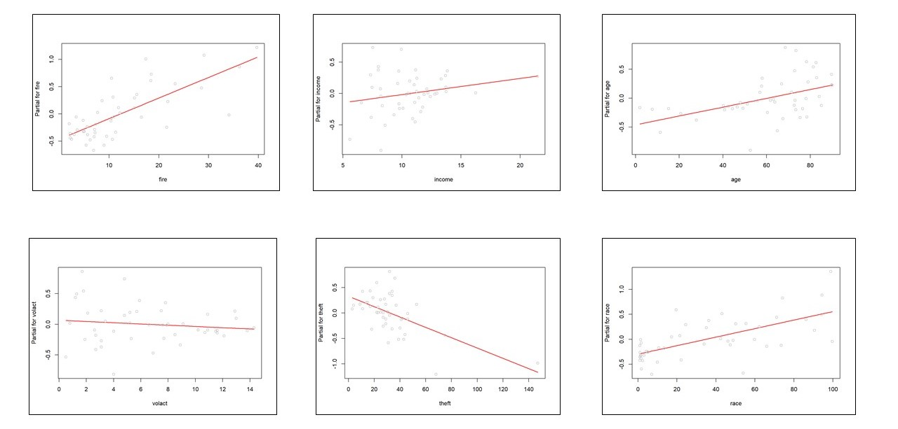

# Chicago Insurance Redlining (Regression Analysis) 

## Are people of color more likely to be turned down for a mortgage in Chicago than their white counterparts, even when they make the same amount of money?

## Introduction #
The term redlining originates from the 1930s practice of color-coding maps of cities based on different neighborhoods’ eligibility to receive a loan or mortgage. The lowest ranked neighborhoods were often literally lined in red and were almost always a community of color or other marginalized identity.

Redlining began in 1935 when the Home Owner’s Loan Corporation began producing maps of virtually every major city upon request of the Federal Home Loan Bank Board.

Neighborhoods were color coded based on their desirability, from “A - First Grade” to “D - Fourth Grade.” Most often the “D” ranking neighborhoods were black communities, or other communities of minorities, while the “A” ranking neighborhoods were affluent white suburbs.
The maps were used by both public and private banks and loan offices to directly discriminate and refuse loans to residents of the “D” neighborhoods.

The Fair Housing Act of 1968 made discrimination during the process of selling a house illegal, yet redlining was not effectively outlawed until 1977. The Home Mortgage Disclosure Act of 1975 required transparency thus making redlining unfeasible, and was followed by the Community Reinvestment Act of 1977 that finally prohibited it

  *A red lined map of Oakland, California, created by Home Owner’s Loan Corporation.*

## Data Source 

In a study of insurance availability in Chicago, the U.S. Commission on Civil Rights attempted to examine charges by several community organizations that insurance companies were redlining their neighborhoods, i.e. canceling policies or refusing to insure or renew.

First the Illinois Department of Insurance provided the number of cancellations, non-renewals, new policies, and renewals of homeowners and residential fire insurance policies by ZIP code for the months of December 1977 through February 1978. The companies that provided this information account for more than 70% of the homeowner’s insurance policies written in the City of Chicago. The department also supplied the number of FAIR plan policies written a renewed in Chicago by zip code for the months of December 1977 through May 1978. Since most FAIR plan policyholders secure such coverage only after they have been rejected by the voluntary market, rather than as a result of a preference for that type of insurance, the distribution of FAIR plan policies is another measure of insurance availability in the voluntary market.

Secondly, the Chicago Police Department provided crime data, by beat, on all thefts for the year 1975. Most Insurance companies claim to base their underwriting activities on loss data from the preceding years, i.e. a 2-3-year lag seems reasonable for analysis purposes. the Chicago Fire Department provided similar data on fires occurring during 1975. These fire and theft data were organized by zip code.

Finally, the US Bureau of the census supplied data on racial composition, income and age and value of residential units for each ZIP code in Chicago. To adjust for these differences in the populations size associated with different ZIP code areas, the theft data were expressed as incidents per 1,000 population and the fire and insurance data as incidents per 100 housing units.

Source: [(here)](https://rdrr.io/cran/faraway/man/chredlin.html).

## Features #

- **race racial:** composition in percent minority
- **fire:** fires per 100 housing units
- **theft:** theft per 1000 population
- **age:** percent of housing units built before 1939
- **volact:** new homeowner policies plus renewals minus cancellations and non-renewals per 100 housing units
- **involact:** new FAIR plan policies and renewals per 100 housing units
- **income:** median family income

## Goal #
To compute the effect of different parameters on insurance redlining in 1975, in which race has been a dominant contributor. To Creating a Linear model for the involuntary market activity variable (the number getting FAIR plan insurance) based on the other parameters. Hence, we can compare the parameters who effects the redlining most in the past vs the one’s which are affecting it now. This regression analysis will give a comparison matric to the policy maker to measure the changes of insurance redlining now and then.  

## Exploratory Data Analysis #
Boxplots show some unusual observations, that we are later going to deal with.

## Linear Model Assumptions ##
### Linearity Check
On full model (model with all predictors) I found that all predictors posses linear relationship with response.

### Normality of Errors 
qqnorm gives fatter tails distribution.

**Shapiro-Wilk normality test:** gives **p-value = 0.6317**. High p-value  favors the null hypotheses that the distribution is normal. 

### Error Variance 
It Looks that model have constant variance with few anomalies.

### Multi-Colinearity
Variance Inflation factors:
Every Predictor is under 5. We can proceed. However, *volact* has relatively high correlation with other predictors.

**Base Model:** 
Residual standard error: 0.3387 on 40 degrees of freedom 
Multiple R-squared:  0.7517, Adjusted R-squared:  0.7144 
F-statistic: 20.18 on 6 and 40 DF,  p-value: 1.072e-10 

**Model without *volact*:** 
Residual standard error: 0.3351 on 41 degrees of freedom 
Multiple R-squared:  0.7508, Adjusted R-squared:  0.7204 
F-statistic: 24.71 on 5 and 41 DF,  p-value: 2.159e-11 

Comparing R-squared model without *volcat* performs better. Same result can be observed when comparing both hypotheses using **anova**. 

**Model without *income*:** 
As income have high p-value, I tested removing it from the model.
  Residual standard error: 0.3335 on 42 degrees of freedom
  Multiple R-squared:  0.7472, Adjusted R-squared:  0.7231
  F-statistic: 31.03 on 4 and 42 DF,  p-value: 4.799e-12

Removing income does not make much of the difference in model performance as there is very less change in R-squared.

## Unusual Observations ##
### Leverage Points
Few leverage points can be observed via *halfnorm plot*.

I build the model with and without these points and they actually does not effect the model performance. 

**Further Investigation:**

.

This observation theft value is far higher than other observation. it must reported or investigated more thoroughly.

### Outliers
Following are the outlier observations

**zips**  | **residuals**  
60653 | 0.990274659  
60613 | 1.127907196  
60621 |	1.288022823  
60610 | 1.374325778  

I build the model with and without these outlier, and found that model performance do not get influenced by these outliers. 

### Influential Observations
plotted cooks-distance diagram and found that no point is Over 0.5 the cook's boundary. hence we have no influential observations.

.

## Transformations

Transformed *theft* to various polynomial degrees and also tried power transformations. It turned out that non of them improves the model performance.

### Final Model
involact    ~     0.008104  x race 
		+ 0.039080 x fire 
		+ (-0.009592 ) x theft
		+ 0.007210 x  age

## Conclusion

We can concluded racial composition, fire, theft and age of housing drives the insurance redlining. However, the family income was not a significant contributor. Taking these factor into account policy makers can make sure to make better polices and laws to outlaw redlining especially the racial composition factor. Resulting, making equal opportunities for every national.  

Futhermore, we question that  is a *involact* is true representative of redlining or we can come with better measure? How redlining have changed over the period of time? How these analysis can be used for better policy making. 
